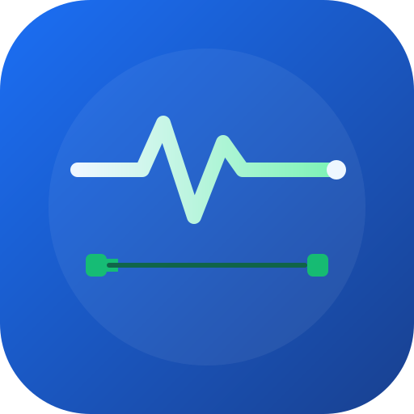

<div align="center">



# 🏋️ FisioPrescribe

**Plataforma de apoio à prescrição de exercício físico para personal trainers** —
digite a patologia e receba um relatório técnico completo: o que é, tratamento
possível e indicação de exercício físico baseada em evidências.

[](#)
[](#)
[](LICENSE)
[](#)
[](#-desenvolvimento-orientado-por-especificação-spec-kit)

### 🌐 [Acessar o FisioPrescribe](https://gegeu-sp.github.io/FisioPrescribe/)

</div>

---

## 📋 Sobre o Projeto

O **FisioPrescribe** é uma ferramenta educacional de apoio à decisão, criada para
personal trainers e equipes de saúde, que transforma o nome de uma patologia em
um protocolo completo de orientação.

A plataforma integra APIs públicas e gratuitas de saúde (NIH/NLM) com uma base
própria de diretrizes (ACSM/OMS), entregando em segundos um relatório
estruturado em 4 dimensões:

| Dimensão | Descrição | Fonte |
|---|---|---|
| 📖 O que é | Descrição clínica, sinais/sintomas, prevalência e nível de risco | NIH Clinical Tables |
| 💊 Tratamento | Abordagens não farmacológicas + medicamentos comuns e seus efeitos no exercício | RxNorm (NLM) |
| 🏃 Exercício | Protocolo FITT (volume, intensidade, frequência) + contraindicações | ACSM / OMS 2020 |
| 📄 Relatório | Documento final exportável (imprimir / copiar / .txt) | — |

## ✨ Funcionalidades

- 🔍 Busca inteligente com autocomplete e normalização de acentos (ex.: "hipertensão" = "hipertensao")
- ⚡ Análise instantânea offline para patologias da base local
- 🌐 Fallback online via NIH Clinical Tables para condições fora da base
- 💊 Verificação de medicamentos em tempo real na RxNorm (RXCUI)
- 🏷️ Chips rápidos para as patologias mais comuns
- 📑 Relatório exportável: imprimir/PDF, copiar texto ou baixar `.txt`
- 🌙 Tema claro/escuro com persistência (`localStorage`), aplicado antes do primeiro paint
- 📱 Design responsivo (mobile-first)
- ⚠️ Sistema de risco com barra visual e precauções específicas
- 🖨️ Modo impressão otimizado (isola apenas o relatório)
- 🛡️ Conteúdo de terceiros (API pública) sempre escapado antes de renderizar

## 🧬 Patologias da Base Local

| Patologia | CID-10 | Risco | Foco do protocolo |
|---|---|---|---|
| Hipertensão Arterial | I10 | 🟡 Moderado | Aeróbico diário + handgrip |
| Diabetes Mellitus Tipo 2 | E11 | 🟡 Moderado | Aeróbico + resistido (glicemia) |
| Obesidade | E66 | 🟢 Baixo–moderado | Alto volume + baixo impacto |
| Osteoartrite | M17 | 🟢 Baixo | Hidro + fortalecimento |
| Asma Brônquica | J45 | 🟢 Baixo–moderado | Aquecimento gradual |
| Transtorno Depressivo | F32 | 🟢 Baixo | Aeróbico + social |
| Lombalgia Crônica | M54 | 🟢 Baixo | Core (McGill Big 3) |
| Osteoporose | M81 | 🟡 Moderado | Carga + prevenção de quedas |

Para qualquer outra condição, a plataforma consulta a NIH Clinical Tables e gera
um relatório conservador com as diretrizes gerais da OMS + alerta de liberação
médica.

## 🛠️ Tecnologias

| Camada | Tecnologia |
|---|---|
| Estrutura | HTML5 semântico |
| Estilos | Tailwind CSS pré-compilado (`assets/tailwind.css`, sem script em runtime) + CSS customizado |
| Interatividade | JavaScript Vanilla (ES6+, sem frameworks) |
| Ícones | SVGs do Lucide embutidos no próprio `index.html` (sem CDN em runtime) |
| Fontes | Inter (corpo) e Manrope (títulos), via `<link>` |
| Impressão | `@media print` nativo |

**Zero dependência de runtime**: nada no visual do app depende de um script
externo terminar de carregar/executar no seu navegador — `assets/tailwind.css`
e os ícones já vêm prontos no arquivo. Isso evita telas quebradas em redes
lentas, bloqueadores de conteúdo ou navegadores embutidos (ex.: WhatsApp)
que restringem scripts de terceiros. Só as fontes web (Inter/Manrope) usam
`<link>` externo, com fallback gracioso para fontes do sistema.

Nenhuma dependência de build para *usar* o app — basta abrir o `index.html`
no navegador. Build é necessário só se você alterar as classes Tailwind
usadas no HTML (veja o comentário no topo de `assets/tailwind.css`).

## 🔌 APIs Utilizadas

Todas públicas, gratuitas e sem necessidade de chave:

**NIH Clinical Table Search Service** — base de dados clínicos da National
Library of Medicine com milhares de condições (timeout de 7s, com fallback
gracioso em caso de falha).
```
GET https://clinicaltables.nlm.nih.gov/api/conditions/v3/search?terms={termo}&maxList=1
```

**RxNorm REST API (NLM)** — nomenclatura padronizada de medicamentos
(identificador único RXCUI), verificada de forma assíncrona sem bloquear o
relatório (timeout de 5s).
```
GET https://rxnav.nlm.nih.gov/REST/drugs.json?name={medicamento}
```

📄 Documentação completa (parâmetros, exemplos de requisição/resposta,
estratégia de fallback e APIs candidatas para o roadmap) em
[`docs/API.md`](docs/API.md) — também disponível como
[página navegável](https://claude.ai/code/artifact/b288e541-d474-40f1-9b00-ece1e2c4fae7).

**Base de Diretrizes Própria** — conteúdo curado a partir de:
- ACSM — American College of Sports Medicine
- OMS 2020 — Diretrizes de Atividade Física
- PCDT — Protocolos Clínicos do Ministério da Saúde

## 🚀 Como Usar

A forma mais rápida é acessar a versão publicada:
**[gegeu-sp.github.io/FisioPrescribe](https://gegeu-sp.github.io/FisioPrescribe/)**
(atualizada automaticamente a cada push em `main`, via GitHub Actions).

Para rodar localmente:

**Opção 1 — Direto no navegador**
```bash
git clone https://github.com/Gegeu-sp/FisioPrescribe.git
cd FisioPrescribe
open index.html   # macOS
xdg-open index.html   # Linux
```

**Opção 2 — Servidor local (recomendado)**
```bash
# Python
python3 -m http.server 8080

# ou Node
npx serve
```
Acesse `http://localhost:8080`.

**Fluxo:**
1. Digite a patologia no campo de busca (ou clique em um chip rápido).
2. Clique em **Analisar** (ou pressione Enter).
3. Navegue pelas abas: *O que é* → *Tratamento* → *Exercício Físico* → *Relatório Final*.
4. Exporte o relatório (imprimir / copiar / baixar `.txt`).

## 🏗️ Arquitetura

```
┌─────────────────────────────────────────────┐
│              INTERFACE (HTML/CSS)            │
│   Hero · Busca · Tabs · Relatório · Tema     │
└────────────────────┬────────────────────────┘
                      │
         ┌────────────▼───────────┐
         │     MOTOR DE BUSCA      │
         │  normaliza → findLocal  │
         └──┬─────────────────┬───┘
            │                 │
    ┌───────▼──────┐   ┌──────▼──────────┐
    │  BASE LOCAL   │   │  FALLBACK NIH   │
    │ (8 patologias │   │ (Clinical Tables│
    │  instantâneo) │   │  + genérico OMS)│
    └───────┬──────┘   └──────┬──────────┘
            └────────┬─────────┘
                      │
         ┌────────────▼────────────┐
         │  ENRIQUECIMENTO RxNorm   │
         │   (async, não-bloqueia)  │
         └────────────┬────────────┘
                      │
         ┌────────────▼────────────┐
         │  RENDERIZAÇÃO (4 tabs)  │
         │  + Relatório exportável │
         └──────────────────────────┘
```

Princípios de robustez:
- ✅ O núcleo funciona 100% offline (base local).
- ✅ APIs externas são opcionais e com timeout (7s NIH / 5s RxNorm).
- ✅ Nenhuma falha de rede impede a exibição do relatório.
- ✅ Conteúdo de fontes externas é sempre escapado antes de entrar no DOM.

## 📁 Estrutura do Projeto

```
FisioPrescribe/
├── index.html            # aplicação completa (markup + estilos + lógica)
├── assets/
│   ├── icon.svg            # ícone do projeto (fonte vetorial)
│   ├── icon-512.png        # ícone renderizado (favicon / preview social)
│   └── tailwind.css        # Tailwind pré-compilado (ver comentário no topo do arquivo)
├── tailwind.config.js      # tema (cores brand/mint, fontes) usado para gerar tailwind.css
├── docs/
│   └── API.md               # documentação das APIs (NIH, RxNorm, timeouts, roadmap)
├── .specify/               # Spec Kit — templates e memória do projeto
├── .claude/skills/          # skills do Spec Kit para o Claude Code
├── LICENSE                 # MIT
└── README.md
```

O coração do projeto continua sendo um **single-file app** — toda a interface,
estilo e lógica vivem em `index.html` para máxima portabilidade; `assets/`,
`.specify/` e `.claude/` são infraestrutura de apoio (identidade visual e
desenvolvimento orientado por especificação).

## 🎨 Estrutura do Objeto de Patologia

Cada condição na base local (array `DB` em `index.html`) segue este schema:

```js
{
  keys:      ["hipertens", "pressao alta"],   // termos de busca
  nome:      "Hipertensão Arterial Sistêmica",
  cid:       "I10",
  prev:      "27,9% dos adultos (VIGITEL)",
  risco:     55,                 // 0-100 (barra visual)
  rLabel:    "Moderado",
  rCor:      "#f59e0b",
  rNota:     "Exercício reduz PA em 5–8 mmHg...",
  desc:      "Descrição clínica completa...",
  sint:      ["Cefaleia", "Tontura", ...],
  tratGeral: ["Dieta DASH", "Perda de peso", ...],
  meds:      [{ n:"Losartana", g:"losartan", c:"BRA", e:"efeito no exercício" }],
  proto:     { vol:"150–300 min", int:"Moderada", freq:"5–7 dias" },
  exer:      [{ i:"footprints", t:"Aeróbico", f:"5x/sem", d:"30–60 min", in:"Moderada", n:"nota" }],
  contra:    ["PA > 180/110: não iniciar", ...]
}
```

## 📐 Desenvolvimento orientado por especificação (Spec Kit)

Este projeto usa o [GitHub Spec Kit](https://github.com/github/spec-kit) para
guiar novas funcionalidades por especificação → plano → tarefas →
implementação, em vez de código ad hoc direto no `index.html`. A constituição
do projeto (princípios, padrões técnicos e fluxo de trabalho) está em
[`.specify/memory/constitution.md`](.specify/memory/constitution.md).

Fluxo recomendado para novas features (via Claude Code):

```
/speckit-constitution   # revisar/ajustar princípios do projeto
/speckit-specify        # descrever a nova funcionalidade
/speckit-plan            # gerar o plano técnico
/speckit-tasks           # quebrar em tarefas executáveis
/speckit-implement       # implementar
```

## 🗺️ Roadmap

- [x] **Fase 1 (MVP)** — Base local + NIH + RxNorm + relatório exportável
- [ ] **Fase 2** — Expandir base para 30+ patologias
- [ ] **Fase 3** — Salvar relatórios por cliente (`localStorage`/IndexedDB)
- [ ] **Fase 4** — Integração com CID-11 e tabela de procedimentos do DATASUS
- [ ] **Fase 5** — PWA (instalável + offline completo)
- [ ] **Fase 6** — Backend próprio para gestão de equipe de trainers

## ⚖️ Aviso Legal e Ética

> ⚠️ **IMPORTANTE — leia antes de usar**
>
> - Esta plataforma é uma **ferramenta educativa de apoio à decisão**.
> - **NÃO substitui** avaliação médica, fisioterapêutica ou nutricional.
> - Personal trainers **não prescrevem medicamentos** — as informações
>   farmacológicas servem apenas para entender efeitos no desempenho (ex.:
>   betabloqueador reduz FC máxima).
> - A prescrição final é sempre responsabilidade do profissional, baseada em
>   avaliação individual completa.
> - Em caso de sinais de risco, encaminhe ao médico imediatamente.

**LGPD** — O MVP não coleta dados pessoais sensíveis dos clientes. Se você
evoluir para armazenamento de dados de saúde, atente-se à Lei Geral de
Proteção de Dados (LGPD) — dados de saúde são dados sensíveis e exigem
consentimento explícito e criptografia.

## 🤝 Contribuindo

Contribuições são bem-vindas! Para adicionar uma nova patologia à base local:

1. Siga o schema do objeto de patologia (seção acima).
2. Baseie as diretrizes em fontes oficiais (ACSM, OMS, PCDT).
3. Abra um Pull Request com as referências.

## 📄 Licença

Este projeto é distribuído sob a licença [MIT](LICENSE).

## 🙏 Agradecimentos

- **NIH / National Library of Medicine** — Clinical Tables e RxNorm
- **ACSM** — Diretrizes de prescrição de exercício
- **OMS** — Diretrizes de Atividade Física 2020
- Comunidade **Tailwind CSS** e **Lucide Icons**

---

<div align="center">
<sub>Feito com 💙 para profissionais de educação física.<br>FisioPrescribe · Movimento é medicina.</sub>
</div>
